# Deploy LlaMA 3.1

Get deployment and configuration resource files

```shell
git clone https://gitlab.consulting.redhat.com/ai-odyssey-2025/gcg-ssa-team/llama-serving.git
```

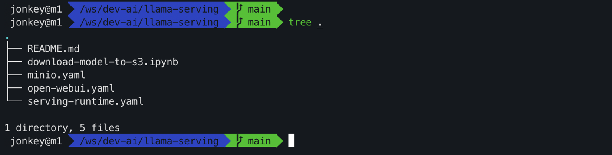

## Install minio

Create a new project, named `minio`

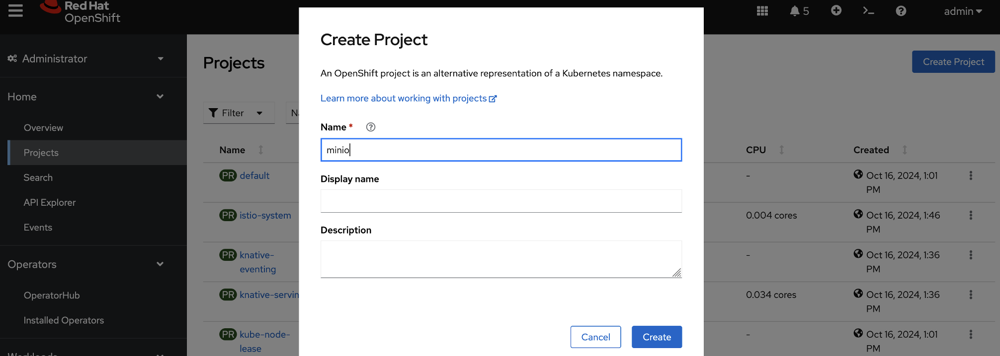

Import minio deployment resources from the web console

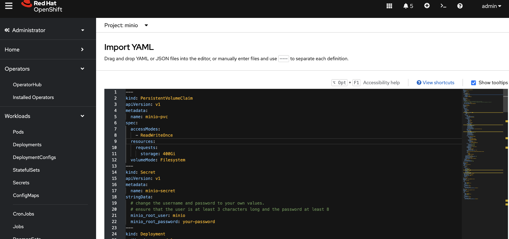

The content of minio.yaml is as follows. You will need to adjust the root username and password.

https://gitlab.consulting.redhat.com/ai-odyssey-2025/gcg-ssa-team/llama-serving/-/raw/main/minio.yaml

```yaml
---
kind: PersistentVolumeClaim
apiVersion: v1
metadata:
  name: minio-pvc
spec:
  accessModes:
    - ReadWriteOnce
  resources:
    requests:
      storage: 400Gi
  volumeMode: Filesystem
---
kind: Secret
apiVersion: v1
metadata:
  name: minio-secret
stringData:
  # change the username and password to your own values.
  # ensure that the user is at least 3 characters long and the password at least 8
  minio_root_user: minio
  minio_root_password: your-password
---
kind: Deployment
apiVersion: apps/v1
metadata:
  name: minio
spec:
  replicas: 1
  selector:
    matchLabels:
      app: minio
  template:
    metadata:
      creationTimestamp: null
      labels:
        app: minio
    spec:
      volumes:
        - name: data
          persistentVolumeClaim:
            claimName: minio-pvc
      containers:
        - resources:
            limits:
              cpu: 250m
              memory: 1Gi
            requests:
              cpu: 20m
              memory: 100Mi
          readinessProbe:
            tcpSocket:
              port: 9000
            initialDelaySeconds: 5
            timeoutSeconds: 1
            periodSeconds: 5
            successThreshold: 1
            failureThreshold: 3
          terminationMessagePath: /dev/termination-log
          name: minio
          livenessProbe:
            tcpSocket:
              port: 9000
            initialDelaySeconds: 30
            timeoutSeconds: 1
            periodSeconds: 5
            successThreshold: 1
            failureThreshold: 3
          env:
            - name: MINIO_ROOT_USER
              valueFrom:
                secretKeyRef:
                  name: minio-secret
                  key: minio_root_user
            - name: MINIO_ROOT_PASSWORD
              valueFrom:
                secretKeyRef:
                  name: minio-secret
                  key: minio_root_password
          ports:
            - containerPort: 9000
              protocol: TCP
            - containerPort: 9090
              protocol: TCP
          imagePullPolicy: IfNotPresent
          volumeMounts:
            - name: data
              mountPath: /data
              subPath: minio
          terminationMessagePolicy: File
          image: >-
            quay.io/minio/minio:RELEASE.2024-10-02T17-50-41Z
          args:
            - server
            - /data
            - --console-address
            - :9090
      restartPolicy: Always
      terminationGracePeriodSeconds: 30
      dnsPolicy: ClusterFirst
      securityContext: {}
      schedulerName: default-scheduler
  strategy:
    type: Recreate
  revisionHistoryLimit: 10
  progressDeadlineSeconds: 600
---
kind: Service
apiVersion: v1
metadata:
  name: minio-service
spec:
  ipFamilies:
    - IPv4
  ports:
    - name: api
      protocol: TCP
      port: 9000
      targetPort: 9000
    - name: ui
      protocol: TCP
      port: 9090
      targetPort: 9090
  internalTrafficPolicy: Cluster
  type: ClusterIP
  ipFamilyPolicy: SingleStack
  sessionAffinity: None
  selector:
    app: minio
---
kind: Route
apiVersion: route.openshift.io/v1
metadata:
  name: minio-api
spec:
  to:
    kind: Service
    name: minio-service
    weight: 100
  port:
    targetPort: api
  wildcardPolicy: None
  tls:
    termination: edge
    insecureEdgeTerminationPolicy: Redirect
---
kind: Route
apiVersion: route.openshift.io/v1
metadata:
  name: minio-ui
spec:
  to:
    kind: Service
    name: minio-service
    weight: 100
  port:
    targetPort: ui
  wildcardPolicy: None
  tls:
    termination: edge
    insecureEdgeTerminationPolicy: Redirect
```

After the creation is complete, access the minio console and create a new bucket named `models`.

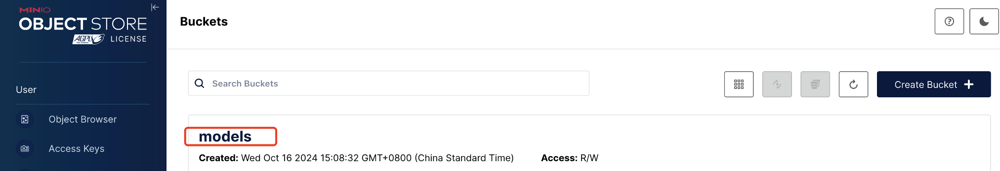

Create a new AKSK, download and save it for later usage.

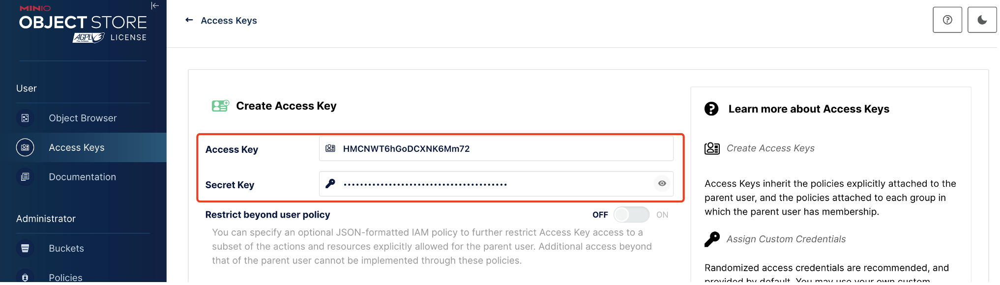

## Deploy model

Navigate to OpenShift AI web console page from quick link.

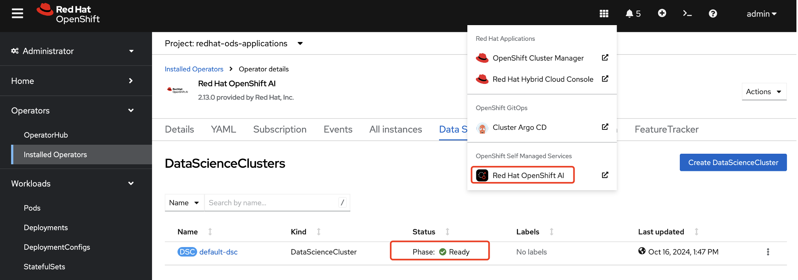

Add new single node multi-card vLLM runtime, the configuration file is as follows:

https://gitlab.consulting.redhat.com/ai-odyssey-2025/gcg-ssa-team/llama-serving/-/raw/main/serving-runtime.yaml

```yaml
apiVersion: serving.kserve.io/v1alpha1
kind: ServingRuntime
metadata:
  annotations:
    opendatahub.io/recommended-accelerators: '["nvidia.com/gpu"]'
    openshift.io/display-name: My vLLM ServingRuntime for KServe
  labels:
    opendatahub.io/dashboard: "true"
  name: my-vllm-runtime
spec:
  annotations:
    prometheus.io/path: /metrics
    prometheus.io/port: "8080"
  containers:
    - args:
        - --port=8080
        - --model=/mnt/models
        - --served-model-name={{.Name}}
        - --distributed-executor-backend=mp
        - --dtype=float16
        - --tensor-parallel-size=8
        - --max-model-len=8000
        - --gpu-memory-utilization=0.9
      command:
        - python
        - -m
        - vllm.entrypoints.openai.api_server
      env:
        - name: HF_HOME
          value: /tmp/hf_home
      image: quay.io/modh/vllm@sha256:2e7f97b69d6e0aa7366ee6a841a7e709829136a143608bee859b1fe700c36d31
      name: kserve-container
      ports:
        - containerPort: 8080
          protocol: TCP
      volumeMounts:
        - mountPath: /dev/shm
          name: shm
  multiModel: false
  supportedModelFormats:
    - autoSelect: true
      name: vLLM
  volumes:
    - emptyDir:
        medium: Memory
        sizeLimit: 128Gi
      name: shm
```

Select `Single-model serving platform` runtime and `REST` protocol.

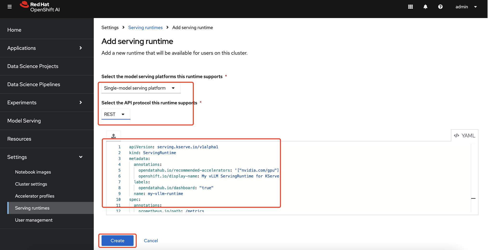

Add a custom notebook image for downloading large model.

- Image location: `quay.io/jonkey/rhods/odh-pytorch-notebook-aria2:2023.2-2`
- Notebook name: `odh-pytorch-notebook-aria2`

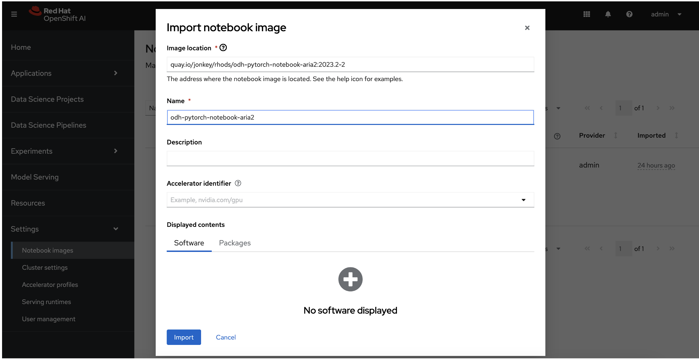

Create an AI project named `llama`

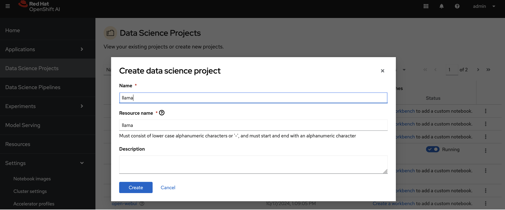

Create a workbench in llama project with the following information:

- Name: `my-wb`
- Notebook Image: `odh-pytorch-notebook-aria2`

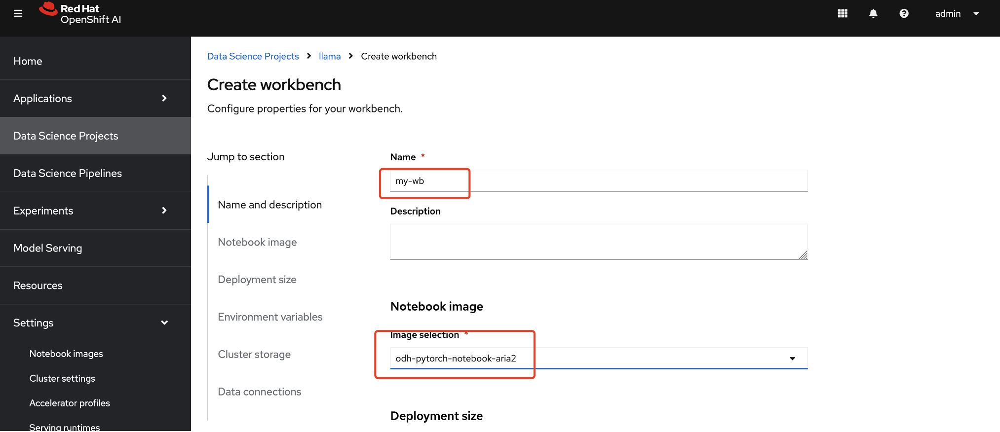

Environment

-  HF_USERNAME: `<your huggingface username>`
-  HF_TOKEN: `<your huggingface token>`

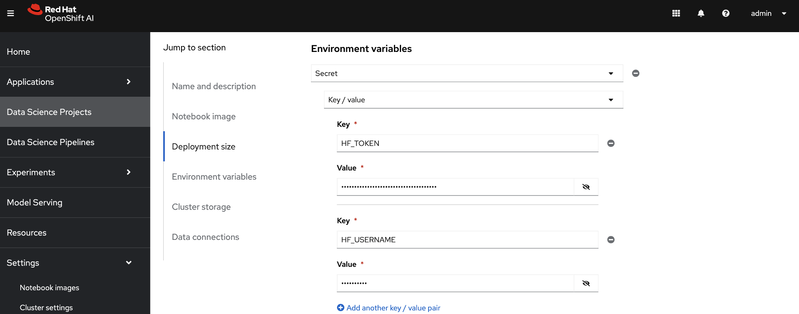

- Container size: `small`
- Storage name: `my-wb`
- Storage size: `300G`

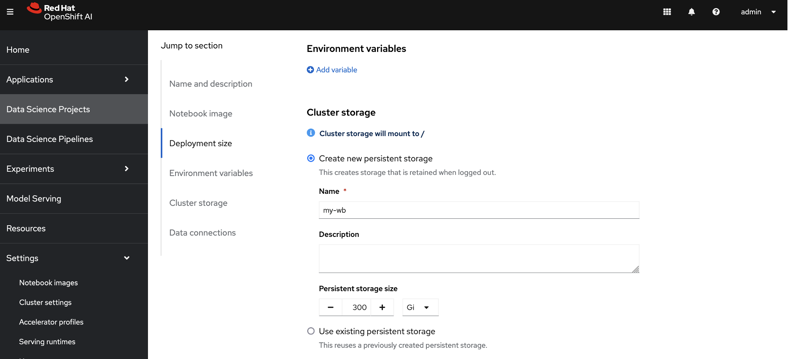

- Data connection name: `models`
- Data connection AK: `<your SK>`
- Data connection SK: `<your SK>`
- Data connection Endpoint: `<your SK>`
- Data connection Region: `none`
- Data connection Bucket: `models`

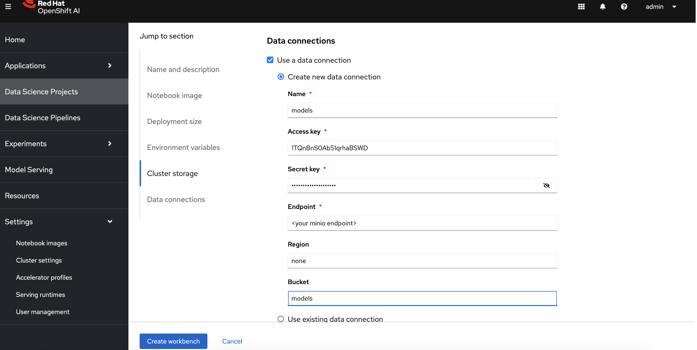

Waiting for workbench creation and running, click `Open` link navigate to the created workbench.

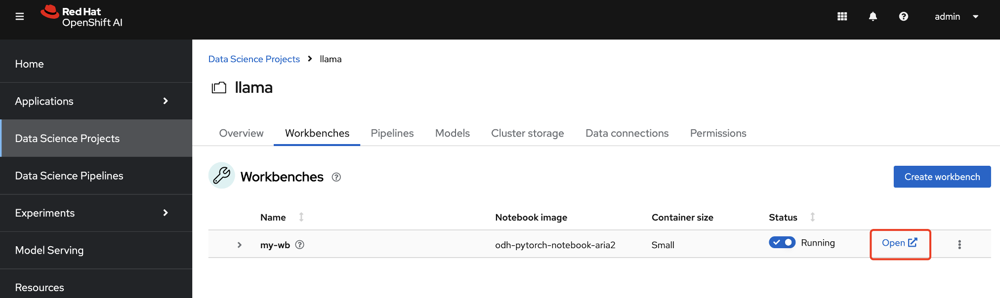

Git clone source code, the url is: https://gitlab.consulting.redhat.com/ai-odyssey-2025/gcg-ssa-team/llama-serving.git

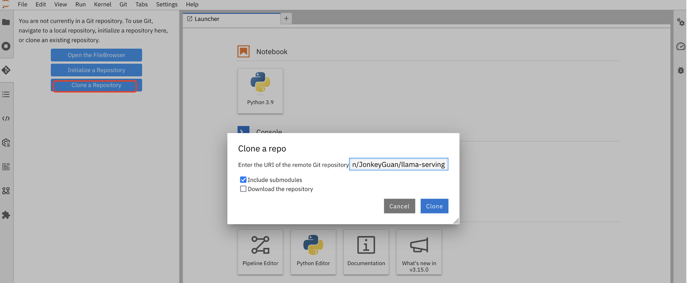

Run the download-mode-to-s3 notebook to download the model.

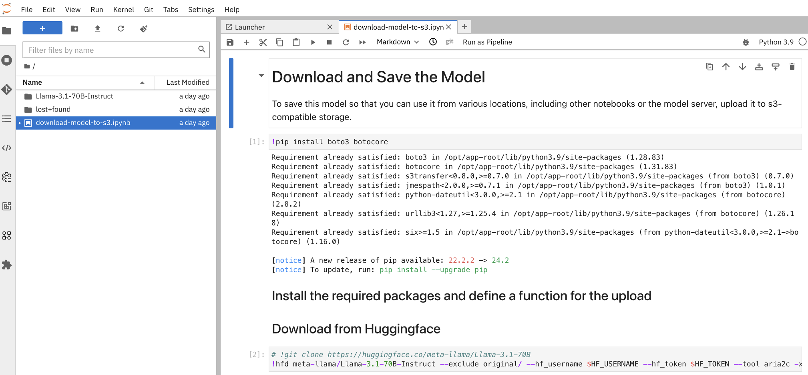

Save the model to object storage.

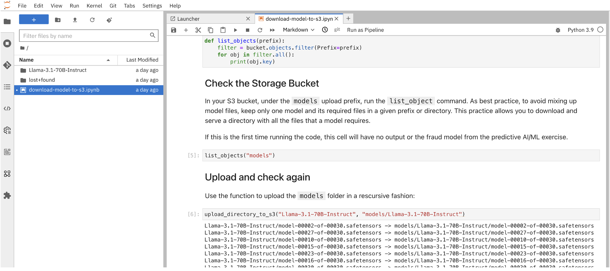

Log in to minio and view the uploaded models.

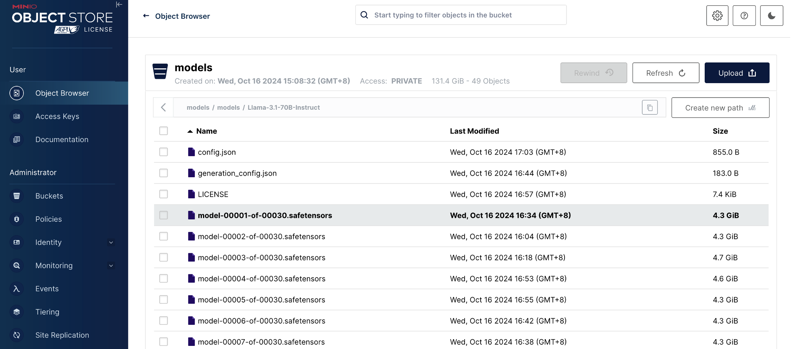

Deploy the model according to the following information

- Model name: `llama`
- Serving runtime: `My vLLM ServingRuntime for KServe`
- Model server replicas: `1`

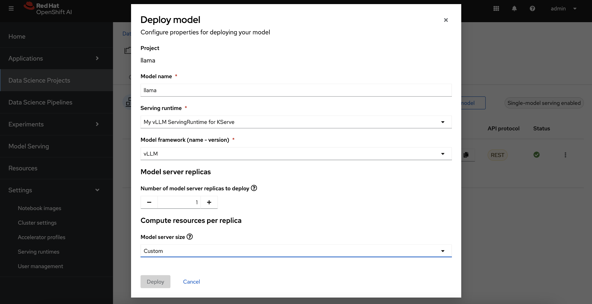

- CPUs requested: `6`

- CPU limit: `12`
- Memory requested: `60Gi`
- Memory limit: `120Gi`
- Accelerator: `NV GPU`
- Number of accelerators: 8
- Make deployed models available through an external route: `checked`
- Require token authentication: `checked`

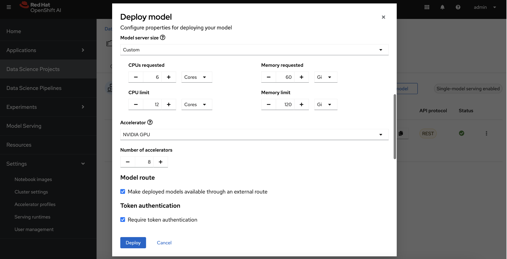

Service account name: `default-name`

Existing data connection:

-  Name: `models`
- Path: `models/Llama-3.1-70B-Instruct`

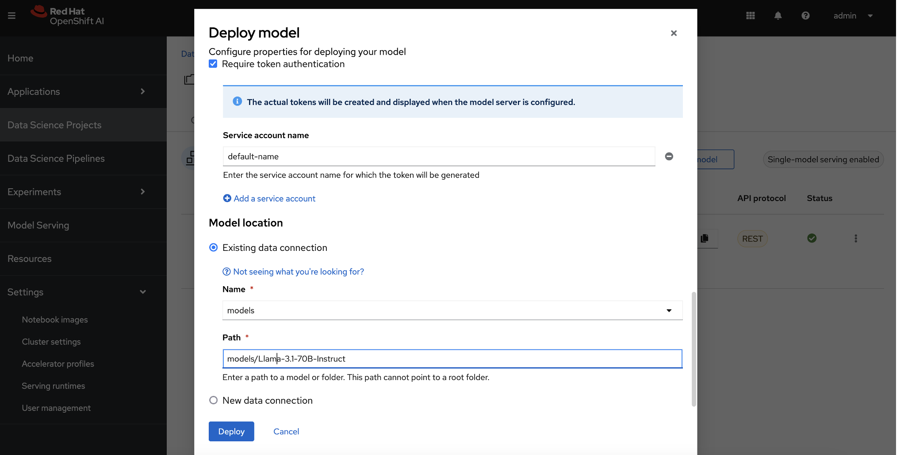

Wait for the deployment to complete.

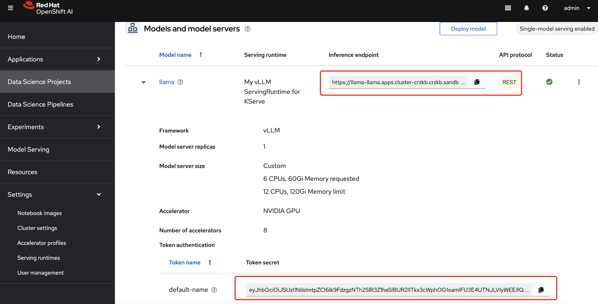

Get and save the url and token from a running model

- Inference endpoint: `<your Inference endpoint >`
- Token secret: `<your Token secret >`

