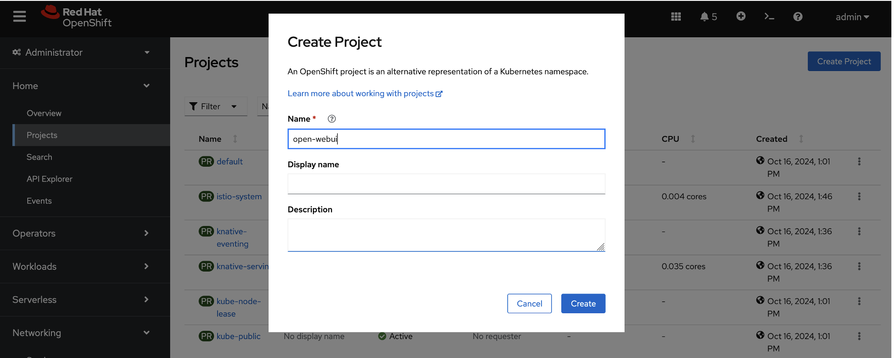
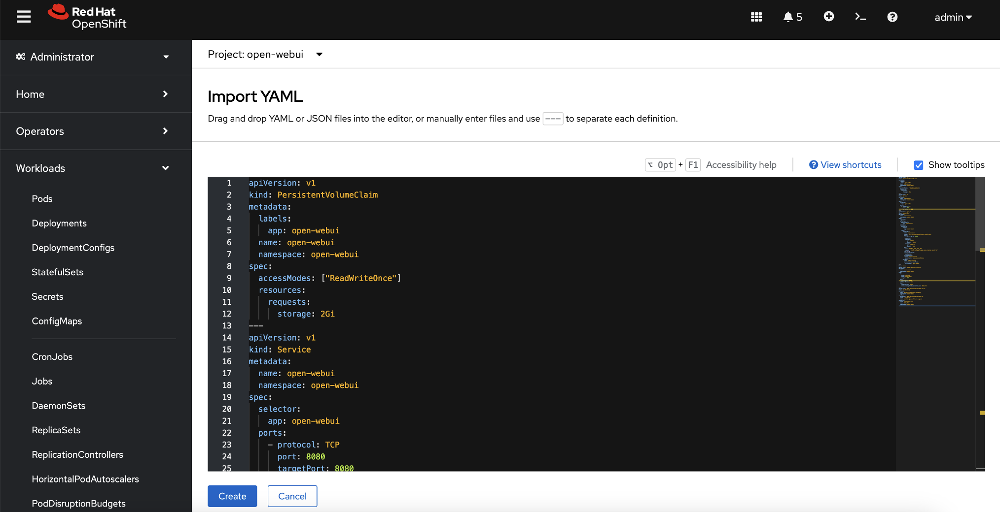
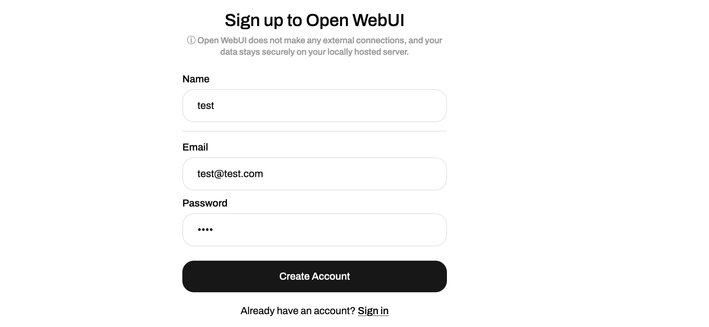
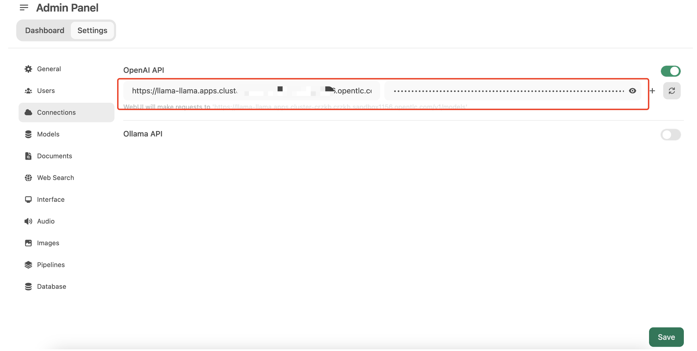
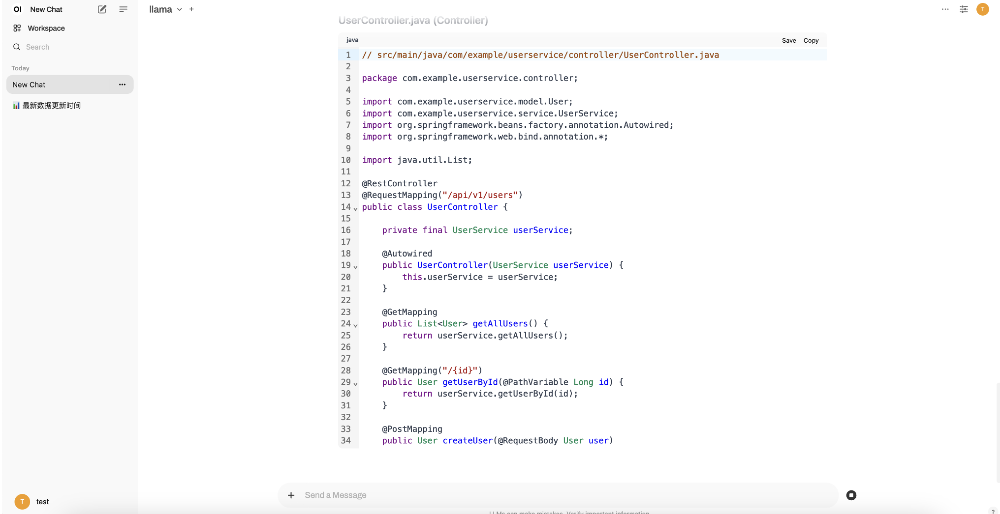
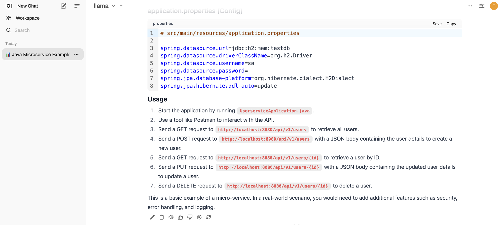

# Configure open-webui

Create a new OpenShift project `open-webui`



Import and create the open-webui resource file open-webui.yaml from OpenShift web console.



content of `open-webui.yaml`

https://gitlab.consulting.redhat.com/ai-odyssey-2025/gcg-ssa-team/llama-serving/-/raw/main/open-webui.yaml

```yaml
apiVersion: v1
kind: PersistentVolumeClaim
metadata:
  labels:
    app: open-webui
  name: open-webui
  namespace: open-webui
spec:
  accessModes: ["ReadWriteOnce"]
  resources:
    requests:
      storage: 2Gi
---
apiVersion: v1
kind: Service
metadata:
  name: open-webui
  namespace: open-webui
spec:
  selector:
    app: open-webui
  ports:
    - protocol: TCP
      port: 8080
      targetPort: 8080
---
apiVersion: apps/v1
kind: Deployment
metadata:
  name: open-webui
  namespace: open-webui
spec:
  replicas: 1
  selector:
    matchLabels:
      app: open-webui
  template:
    metadata:
      labels:
        app: open-webui
    spec:
      containers:
      - name: open-webui
        image: ghcr.io/open-webui/open-webui:main
        ports:
        - containerPort: 8080
        resources:
          requests:
            cpu: "500m"
            memory: "500Mi"
          limits:
            cpu: "1000m"
            memory: "1Gi"
        env:
        - name: OPENAI_API_BASE_URL
          value: "https://llama.llama.svc.cluster.local/v1"
        tty: true
        securityContext:
          runAsUser: 0
        volumeMounts:
        - name: webui-volume
          mountPath: /app/backend/data
      volumes:
      - name: webui-volume
        persistentVolumeClaim:
          claimName: open-webui
---
kind: Route
apiVersion: route.openshift.io/v1
metadata:
  name: open-webui
  namespace: open-webui
spec:
  to:
    kind: Service
    name: open-webui
    weight: 100
  port:
    targetPort: 8080
  wildcardPolicy: None
  tls:
    termination: edge
    insecureEdgeTerminationPolicy: Redirect
---
apiVersion: rbac.authorization.k8s.io/v1
kind: RoleBinding
metadata:
  name: default-sa-anyuid-binding
  namespace: open-webui
roleRef:
  apiGroup: rbac.authorization.k8s.io
  kind: ClusterRole
  name: system:openshift:scc:anyuid
subjects:
- kind: ServiceAccount
  name: default
  namespace: open-webui
```

Access the created open-webui url and register a new user.



Log in to open-webui with the registered user, navigate to the management configuration page, and enter the URL and token of the llama model obtained previously.



Return to the main dialog page and enter the dialog content: `Provide a java code sample of a micro-service`


The model responds to the conversation and outputs the design of the microservice.



The model responds to the conversation and outputs sample code and usage of the microservice.



