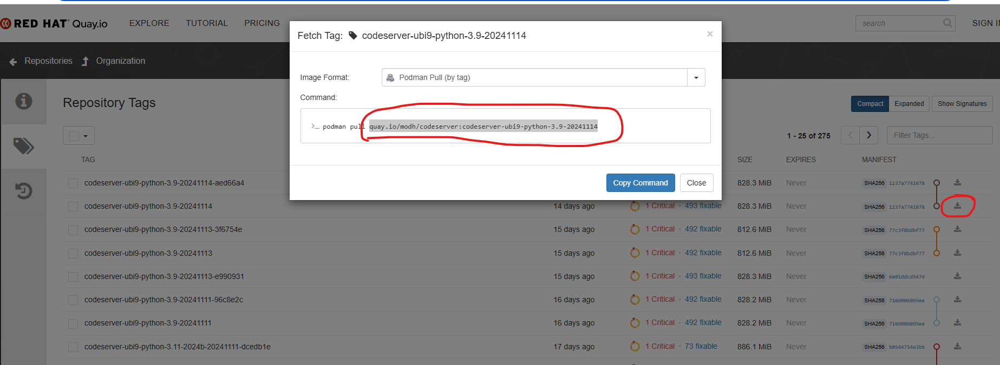
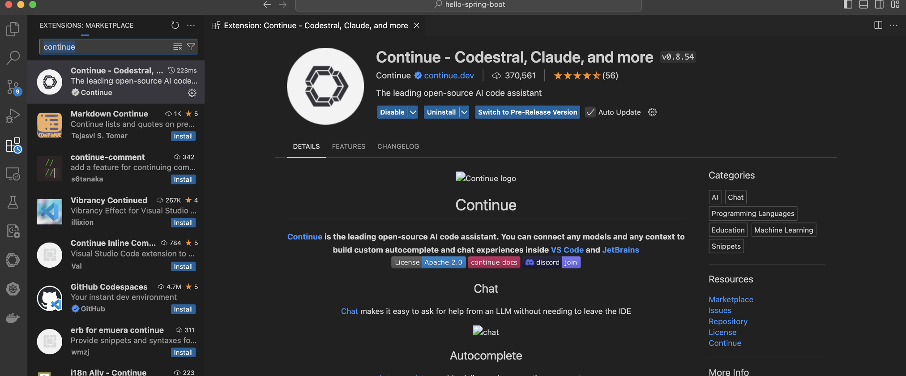
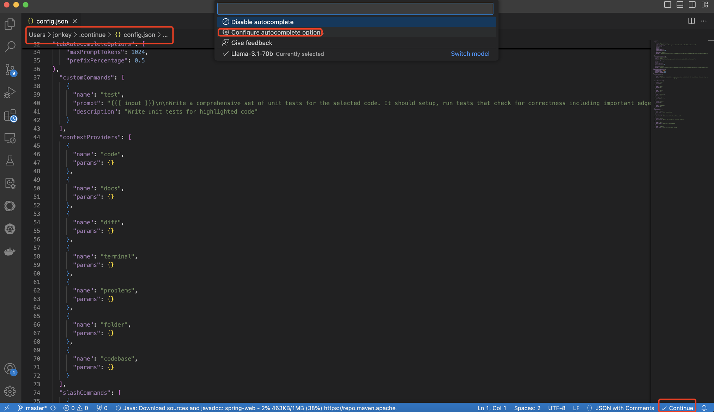
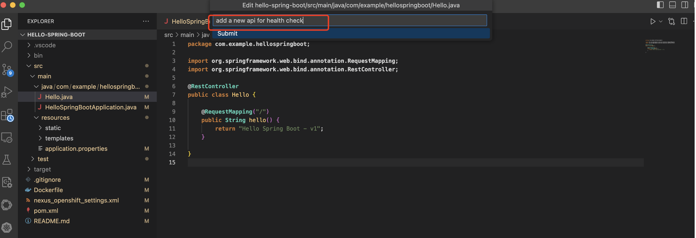
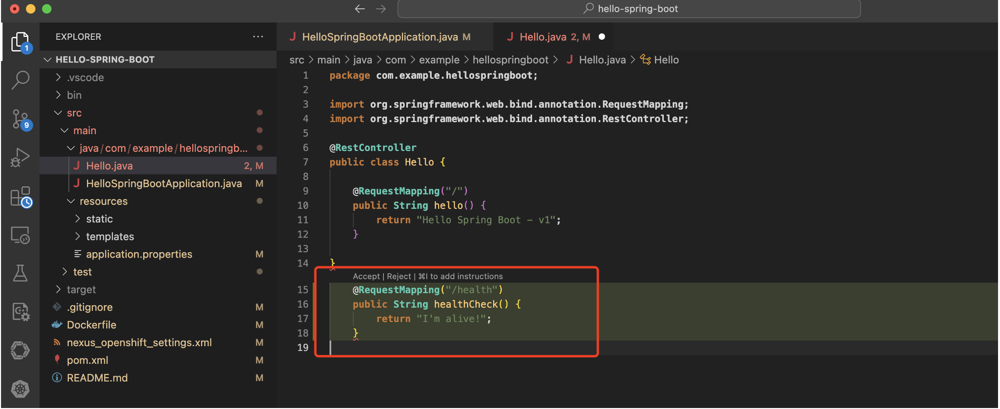

# Configure continue in the web version Code Server

1•	Open the ODH dashboard website, navigate to the "Settings" - "Notebook images" menu, import the custom image which can run a Code Server workbench.
The custom image, like this one. [image](https://quay.io/repository/modh/codeserver?tab=tags&tag=codeserver-ubi9-python-3.9-2023b-20240301-6560116)



2•	Input the image url into the Image location field. Input the new notebook image's name, and remember it, a step in the future we will use the name.

3•	Create a Data Science Project, named codeserver(for example)

4•	Click the "Create a workbench" button

5•	Select the image we just created and remembered

6•	After clicked "Create workbench" button, and the workbench running, click the "Open" url to open the Code Server Web IDE


7•	As Code Server is fully open source, it does not include the Microsoft Marketplace. So you must download the Continue extension file from the [Open VSX Registry](https://open-vsx.org/extension/Continue/continue). Click on the Download button and select the Linux x64 version. You will get a file named Continue.continue-0.9.237@linux-x64.vsix (or whatever version you download).


8•	Create and Start your Workbench based on Code Server:

9•	Upload the plugin file into the Web IDE through the "Install Extension VSIX" menu
Once uploaded, Code server will try to open the file and complain about its size, just close the tab:1

10•	Wait a minute, click the Extension icon, you will see the Contine plugin ready

11•	Click the Contine extension icon, open the config file

12•	Get the Model inference endpoint url and API token secret

13•	Change the apiBase and apiKey value as the following

```

       {
      "title": "mistral",
      "model": "mistral",
      "apiBase": "https://mistral-llm.apps.cluster-w526d.w526d.sandbox1410.opentlc.com/v1/",
      "completionOptions": {
      "temperature": 0.1,
      "topK": 1,
      "topP": 1,
      "presencePenalty": 0,
      "frequencyPenalty": 0
      },
      "provider": "openai",
      "apiKey": "xxxxxx"
    }


   "tabAutocompleteModel": {
      "title": "mistral",
      "model": "mistral",
      "apiBase": "https://mistral-llm.apps.cluster-w526d.w526d.sandbox1410.opentlc.com/v1/",
      "completionOptions": {
      "temperature": 0.1,
      "topK": 1,
      "topP": 1,
      "presencePenalty": 0,
      "frequencyPenalty": 0
      },
      "provider": "openai",
      "apiKey": "xxxxxx"
  },
  "tabAutocompleteOptions": {
      "useCopyBuffer": false,
      "maxPromptTokens": 1024,
      "prefixPercentage": 0.5
  },


```
14•	All look like the following:

15•	Switch to the new Model

16•	Ctrl+I, Try a "write a basic fastapi server" prompt, enjoy the result.

# Configure contine in the VScode client
Search for the Continue extension in vscode and install it.



Add llama configuration items.



The details are as follows, you need to replace `<your llama inference url>` and `<your api key>` portion.

```
{
  "models": [
    {
      "title": "Llama-3.1-70b",
      "model": "llama",
      "apiBase": "https://<your llama inference url>/v1/",
      "completionOptions": {
      "temperature": 0.1,
      "topK": 1,
      "topP": 1,
      "presencePenalty": 0,
      "frequencyPenalty": 0
      },
      "provider": "openai",
      "apiKey": "<your api key>"
    }
  ],
  "tabAutocompleteModel": {
    "title": "Llama-3.1-70b",
    "model": "llama",
    "apiBase": "https://<your llama inference url>/v1/",
    "completionOptions": {
    "temperature": 0.1,
    "topK": 1,
    "topP": 1,
    "presencePenalty": 0,
    "frequencyPenalty": 0
    },
    "provider": "openai",
    "apiKey": "<your api key>"
},
"tabAutocompleteOptions": {
    "useCopyBuffer": false,
    "maxPromptTokens": 1024,
    "prefixPercentage": 0.5
},
  "customCommands": [
    {
      "name": "test",
      "prompt": "{{{ input }}}\n\nWrite a comprehensive set of unit tests for the selected code. It should setup, run tests that check for correctness including important edge cases, and teardown. Ensure that the tests are complete and sophisticated. Give the tests just as chat output, don't edit any file.",
      "description": "Write unit tests for highlighted code"
    }
  ],
  "contextProviders": [
    {
      "name": "code",
      "params": {}
    },
    {
      "name": "docs",
      "params": {}
    },
    {
      "name": "diff",
      "params": {}
    },
    {
      "name": "terminal",
      "params": {}
    },
    {
      "name": "problems",
      "params": {}
    },
    {
      "name": "folder",
      "params": {}
    },
    {
      "name": "codebase",
      "params": {}
    }
  ],
  "slashCommands": [
    {
      "name": "edit",
      "description": "Edit selected code"
    },
    {
      "name": "comment",
      "description": "Write comments for the selected code"
    },
    {
      "name": "share",
      "description": "Export the current chat session to markdown"
    },
    {
      "name": "cmd",
      "description": "Generate a shell command"
    },
    {
      "name": "commit",
      "description": "Generate a git commit message"
    }
  ]
}
```

Use the shortcut key to trigger the code assistant and enter the command: `add a new api for health check`



The code assistant generates a health check API.



