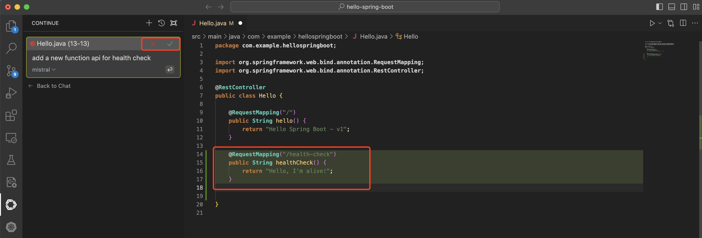

# Configure continue

Search for the Continue extension in vscode and install it.


Add llama configuration items.


The details are as follows, you need to replace `<your llama inference url>` and `<your api key>` portion.

```
{
  "models": [
    {
      "title": "mistral",
      "model": "mistral",
      "apiBase": "https://<your llm inference url>/v1/",
      "completionOptions": {
      "temperature": 0.1,
      "topK": 1,
      "topP": 1,
      "presencePenalty": 0,
      "frequencyPenalty": 0
      },
      "provider": "openai",
      "apiKey": "<your api key>"
    }
  ],
  "tabAutocompleteModel": {
    "title": "mistral",
    "model": "mistral",
    "apiBase": "https://<your llama inference url>/v1/",
    "completionOptions": {
    "temperature": 0.1,
    "topK": 1,
    "topP": 1,
    "presencePenalty": 0,
    "frequencyPenalty": 0
    },
    "provider": "openai",
    "apiKey": "<your api key>"
},
"tabAutocompleteOptions": {
    "useCopyBuffer": false,
    "maxPromptTokens": 1024,
    "prefixPercentage": 0.5
},
  "customCommands": [
    {
      "name": "test",
      "prompt": "{{{ input }}}\n\nWrite a comprehensive set of unit tests for the selected code. It should setup, run tests that check for correctness including important edge cases, and teardown. Ensure that the tests are complete and sophisticated. Give the tests just as chat output, don't edit any file.",
      "description": "Write unit tests for highlighted code"
    }
  ],
  "contextProviders": [
    {
      "name": "code",
      "params": {}
    },
    {
      "name": "docs",
      "params": {}
    },
    {
      "name": "diff",
      "params": {}
    },
    {
      "name": "terminal",
      "params": {}
    },
    {
      "name": "problems",
      "params": {}
    },
    {
      "name": "folder",
      "params": {}
    },
    {
      "name": "codebase",
      "params": {}
    }
  ],
  "slashCommands": [
    {
      "name": "edit",
      "description": "Edit selected code"
    },
    {
      "name": "comment",
      "description": "Write comments for the selected code"
    },
    {
      "name": "share",
      "description": "Export the current chat session to markdown"
    },
    {
      "name": "cmd",
      "description": "Generate a shell command"
    },
    {
      "name": "commit",
      "description": "Generate a git commit message"
    }
  ]
}
```

Use the shortcut key(command + I for MAC) to trigger the code assistant and enter the description: `add a new function api for health check`


The code assistant generates a health check API.


