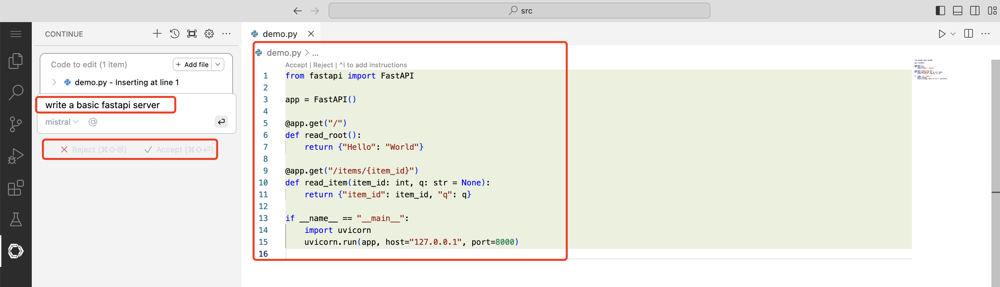

# Configure continue in the web version Code Server

Open the OpenShift AI Web Console, navigate to the `Settings` - `Notebook images` menu, import the custom image which can run a Code Server workbench.


The custom image can be this one. [image](https://quay.io/repository/modh/codeserver?tab=tags&tag=codeserver-ubi9-python-3.9-2023b-20240301-6560116)


Input the image url `quay.io/modh/codeserver:codeserver-ubi9-python-3.9-20241114` into the Image location field. Input the new notebook image's name like `codeserver-ubi9-python-3.9-20241114` ,  please remember it, we will use the name later.


Create a Data Science Project, named `codeserver` (just for example)


Click the `Create a workbench` button


Select the image we just created `codeserver-ubi9-python-3.9-20241114`, name is `My Workbench`, Container size is `Small`,  Accelerator is `None`


After clicked `Create workbench` button, and the workbench running, click the `Open` url to open the Code Server Web IDE


As Code Server is fully open source, it does not include the Microsoft Marketplace. you can download the Continue extension file from the [Open VSX Registry](https://open-vsx.org/extension/Continue/continue). Click on the Download button and select the Linux x64 version. You will get a file named Continue.continue-0.9.237@linux-x64.vsix (or whatever version you download).


Upload the plugin file into the Web IDE through the `Install Extension VSIX` menu
Once uploaded, Code server will try to open the file and complain about its size, just close the tab:1


Wait a minute, click the Extension icon, you will see the Contine plugin ready


Click the Contine extension icon, open the config file


Get the Model Name, Model inference endpoint url and API token secret


Add a new definition named `mistral`,  definition example as the following, you will need to replace `<your llm inference url>` and `<your api key>`, values from previous step.

```
{
  "models": [
    {
      "title": "mistral",
      "model": "mistral",
      "apiBase": "<your llm inference url>/v1/",
      "completionOptions": {
      "temperature": 0.1,
      "topK": 1,
      "topP": 1,
      "presencePenalty": 0,
      "frequencyPenalty": 0
      },
      "provider": "openai",
      "apiKey": "<your api key>"
    }
  ],
  "tabAutocompleteModel": {
    "title": "mistral",
    "model": "mistral",
    "apiBase": "<your llm inference url>/v1/",
    "completionOptions": {
    "temperature": 0.1,
    "topK": 1,
    "topP": 1,
    "presencePenalty": 0,
    "frequencyPenalty": 0
    },
    "provider": "openai",
    "apiKey": "<your api key>"
},
"tabAutocompleteOptions": {
    "useCopyBuffer": false,
    "maxPromptTokens": 1024,
    "prefixPercentage": 0.5
},
  "customCommands": [
    {
      "name": "test",
      "prompt": "{{{ input }}}\n\nWrite a comprehensive set of unit tests for the selected code. It should setup, run tests that check for correctness including important edge cases, and teardown. Ensure that the tests are complete and sophisticated. Give the tests just as chat output, don't edit any file.",
      "description": "Write unit tests for highlighted code"
    }
  ],
  "contextProviders": [
    {
      "name": "code",
      "params": {}
    },
    {
      "name": "docs",
      "params": {}
    },
    {
      "name": "diff",
      "params": {}
    },
    {
      "name": "terminal",
      "params": {}
    },
    {
      "name": "problems",
      "params": {}
    },
    {
      "name": "folder",
      "params": {}
    },
    {
      "name": "codebase",
      "params": {}
    }
  ],
  "slashCommands": [
    {
      "name": "edit",
      "description": "Edit selected code"
    },
    {
      "name": "comment",
      "description": "Write comments for the selected code"
    },
    {
      "name": "share",
      "description": "Export the current chat session to markdown"
    },
    {
      "name": "cmd",
      "description": "Generate a shell command"
    },
    {
      "name": "commit",
      "description": "Generate a git commit message"
    }
  ]
}
```

All look like the following


Switch to the new Model `mistral` for example


Use shortcut Ctrl+I for MAC or Command +I for Windows, Try a  `write a basic fastapi server` prompt, and enjoy the generated code.




# Optional - configure continue in local VScode
Search for the Continue extension in vscode and install it.


Add llm configuration items.


The details are as follows, you need to replace `<your llm inference url>` and `<your api key>` portion.

```
{
  "models": [
    {
      "title": "mistral",
      "model": "mistral",
      "apiBase": "<your llm inference url>/v1/",
      "completionOptions": {
      "temperature": 0.1,
      "topK": 1,
      "topP": 1,
      "presencePenalty": 0,
      "frequencyPenalty": 0
      },
      "provider": "openai",
      "apiKey": "<your api key>"
    }
  ],
  "tabAutocompleteModel": {
    "title": "mistral",
    "model": "mistral",
    "apiBase": "<your llm inference url>/v1/",
    "completionOptions": {
    "temperature": 0.1,
    "topK": 1,
    "topP": 1,
    "presencePenalty": 0,
    "frequencyPenalty": 0
    },
    "provider": "openai",
    "apiKey": "<your api key>"
},
"tabAutocompleteOptions": {
    "useCopyBuffer": false,
    "maxPromptTokens": 1024,
    "prefixPercentage": 0.5
},
  "customCommands": [
    {
      "name": "test",
      "prompt": "{{{ input }}}\n\nWrite a comprehensive set of unit tests for the selected code. It should setup, run tests that check for correctness including important edge cases, and teardown. Ensure that the tests are complete and sophisticated. Give the tests just as chat output, don't edit any file.",
      "description": "Write unit tests for highlighted code"
    }
  ],
  "contextProviders": [
    {
      "name": "code",
      "params": {}
    },
    {
      "name": "docs",
      "params": {}
    },
    {
      "name": "diff",
      "params": {}
    },
    {
      "name": "terminal",
      "params": {}
    },
    {
      "name": "problems",
      "params": {}
    },
    {
      "name": "folder",
      "params": {}
    },
    {
      "name": "codebase",
      "params": {}
    }
  ],
  "slashCommands": [
    {
      "name": "edit",
      "description": "Edit selected code"
    },
    {
      "name": "comment",
      "description": "Write comments for the selected code"
    },
    {
      "name": "share",
      "description": "Export the current chat session to markdown"
    },
    {
      "name": "cmd",
      "description": "Generate a shell command"
    },
    {
      "name": "commit",
      "description": "Generate a git commit message"
    }
  ]
}
```

Use the shortcut key(command + I for MAC, ctrl + I for Windows) to trigger the code assistant and enter the description: `add a new function api for health check`


The code assistant generates a health check API.


