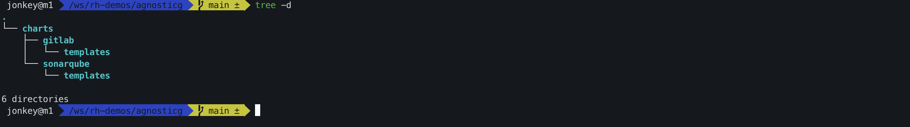

# Configure Code Tools

Get the code tool deployment configuration resource file.

```shell
git clone https://github.com/rh-demos/agnosticg
```

We will setup and configure gitlab and sonarqube later with helm CLI (https://helm.sh/docs/intro/install/)



Log in to your OpenShift cluster via the CLI tool (https://docs.openshift.com/container-platform/4.16/cli_reference/openshift_cli/getting-started-cli.html).

```shell
oc login https://<Your OpenShift API url>:6443
```

