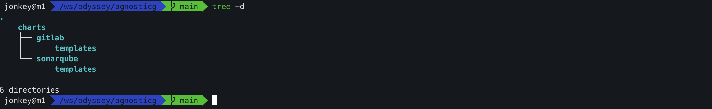

# Configure Code Tools

Get the code tool deployment configuration resource file.

```shell
git clone https://gitlab.consulting.redhat.com/ai-odyssey-2025/gcg-ssa-team/agnosticg.git
```

Next we will use gitlab and sonarqube.



Log in to your OpenShift cluster via the CLI tool.

```shell
oc login https://<Your OpenShift API url>:6443
```

