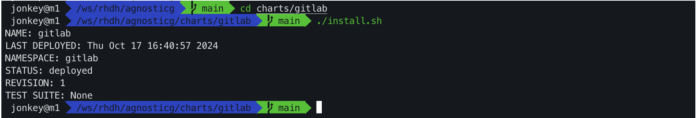
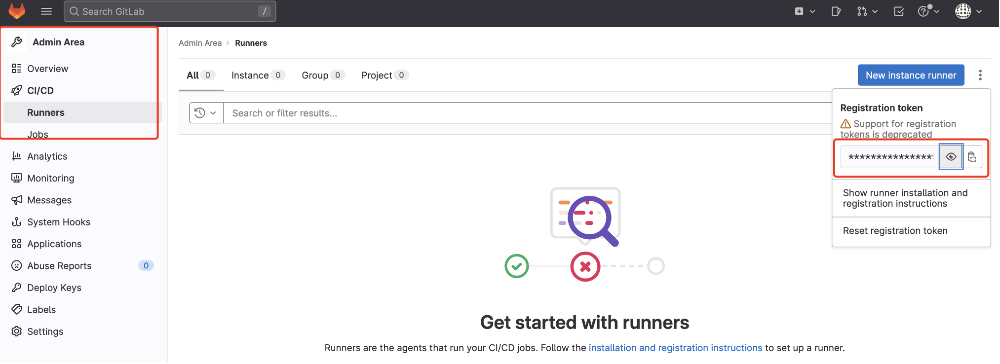
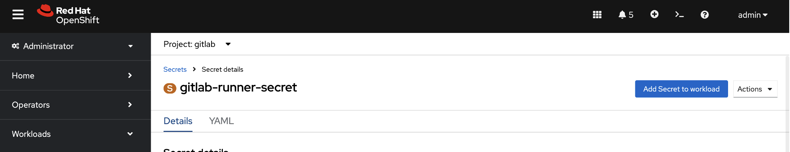
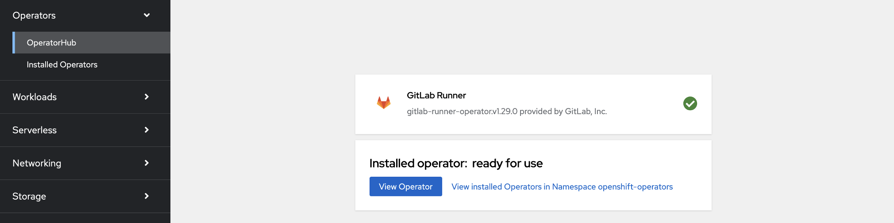
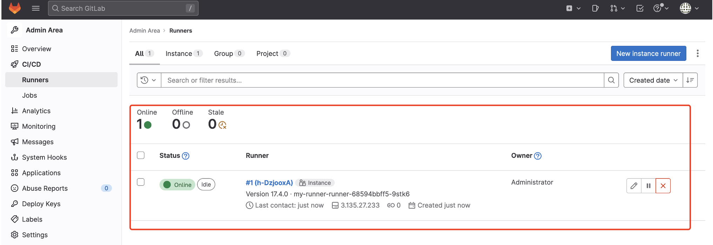

# Configure Gitlab

Modify `<your gitlab host>`,  `<your gitlab user password>` and `<your git lab db password>`in the configuration item in the charts/gitlab/values.yaml file, then install it.

https://raw.githubusercontent.com/rh-demos/agnosticg/refs/heads/main/charts/gitlab/values.yaml

```
cd charts/gitlab
./install.sh
```



Get  gitlab url and access the gitlab page from the browser, navigate to  CICD runner configuration page, and get the registration token for the runner.



Create a secret token from OpenShift

```yaml
kind: Secret
apiVersion: v1
metadata:
  name: gitlab-runner-secret
  namespace: gitlab
data:
  runner-registration-token: <your registration token in base64>
  runner-token: ''
type: Opaque
```



Install GitLab Runner Operator



Create the following Runner resources. The `gitlabUrl` parameter needs to be replaced.

```
apiVersion: apps.gitlab.com/v1beta2
kind: Runner
metadata:
  name: my-runner
  namespace: gitlab
spec:
  gitlabUrl: '<your gitlab url>'
  token: gitlab-runner-secret
```

You can see that the Runner is registered successfully, from the gitlab console page.



