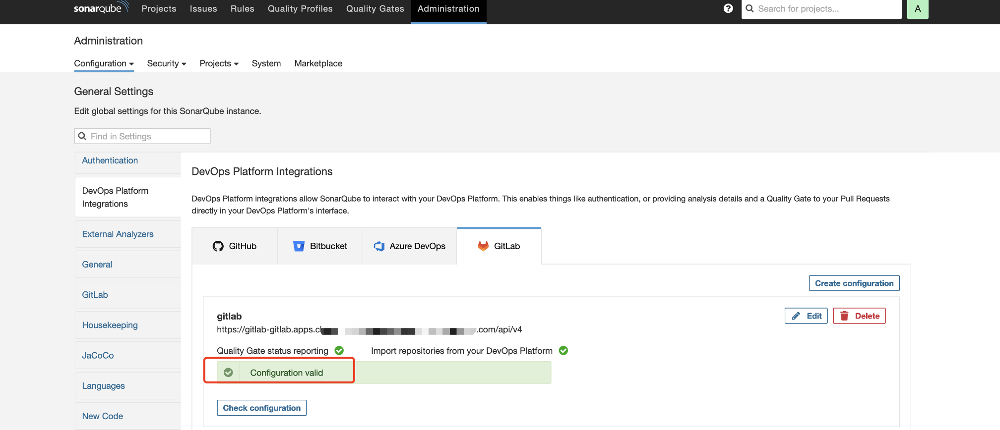

# Configure SonarQube

Switch to the sonarqube directory, modify `<your admin password>` in the configuration item in the charts/sonarqube/values.yaml file, then install it.

https://raw.githubusercontent.com/rh-demos/agnosticg/refs/heads/main/charts/sonarqube/values.yaml

```
cd charts/sonarqube
./install.sh
```

Get the sonarqube URL and access it, accepting the risk of the plugin.


Check and make sure that the Community Branch Plugin and Reporting Plugin are installed successfully.


Configure the URL of sonarqube from the `General Configuration` options and save.


Confiure the sonarqube Access Token from the gitlab page and save it for later.


Add gitlab configuration in the `DevOps Platform Integrations` configuration on the sonarqube page.


Enter the name of the configuration: `gitlab`, `the URL` of gitlab and the `token` created previously.


The configuration verification succeeded.



