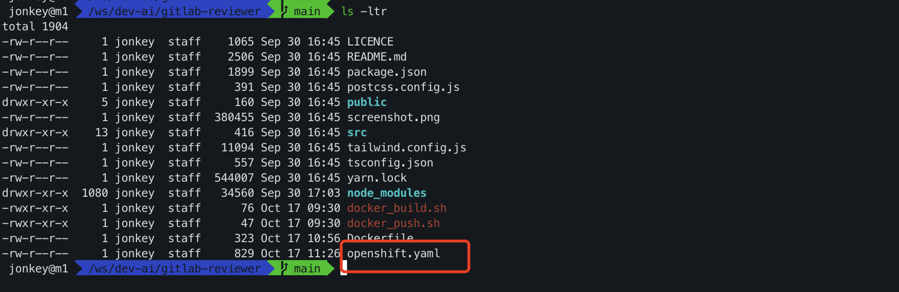
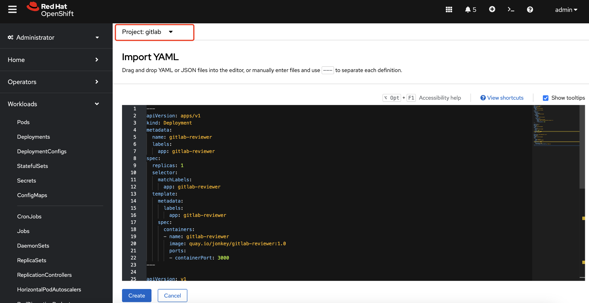
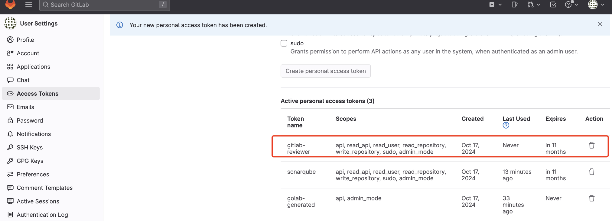
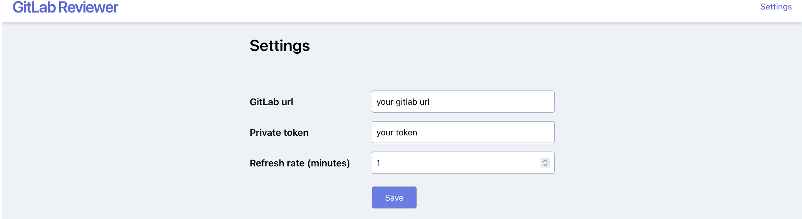

# Configure Gitlab Reviewer

Get the deployment configuration file of GitLab Reviewer.

```
git clone https://github.com/rh-demos/gitlab-reviewer
```



Switch to the gitlab project from OpenShift and import the deployment resource file openshift.yaml of gitlab reviewer



https://raw.githubusercontent.com/rh-demos/gitlab-reviewer/refs/heads/main/openshift.yaml

The content of openshift.yaml is as follows:

```yaml
---
apiVersion: apps/v1
kind: Deployment
metadata:
  name: gitlab-reviewer
  labels:
    app: gitlab-reviewer
spec:
  replicas: 1
  selector:
    matchLabels:
      app: gitlab-reviewer
  template:
    metadata:
      labels:
        app: gitlab-reviewer
    spec:
      containers:
      - name: gitlab-reviewer
        image: quay.io/jonkey/gitlab-reviewer:1.0
        ports:
        - containerPort: 3000
---

apiVersion: v1
kind: Service
metadata:
  name: gitlab-reviewer
spec:
  selector:
    app: gitlab-reviewer
  ports:
  - port: 3000
    targetPort: 3000
  type: ClusterIP
---

apiVersion: route.openshift.io/v1
kind: Route
metadata:
  name: gitlab-reviewer
spec:
  to:
    kind: Service
    name: gitlab-reviewer
  port:
    targetPort: 3000
  tls:
    termination: edge
    insecureEdgeTerminationPolicy: Redirect
---
```

Create an access token for gitlab-reviewer on gitlab.



Get the gitlab reviewer url and access it, enter the `token` created previously and gitlab `url` then `Save` it.



