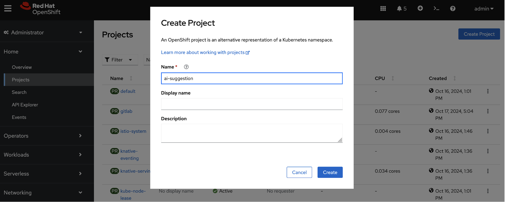

# Configure AI Agent

Get the ai-suggestion deployment configuration file.

```
git clone https://github.com/rh-demos/sonarqube-issue-ai-suggestion
```


Create an access token for ai-agent from gitlab.


Create an access token for ai-agent from sonarqube, the type is for user.


Create the ai-suggestion project from OpenShift.



Import the openshift.xml resource creation file.


The content of the openshift.yaml file is as follows. You will need to replace the `URLs` and `tokens` of `your model`, `gitlab`, and `sonarqube`, your model name will be: `mistral` 

https://raw.githubusercontent.com/rh-demos/sonarqube-issue-ai-suggestion/refs/heads/main/openshift.yaml

```
---
apiVersion: v1
kind: ConfigMap
metadata:
  name: env
data:
  USE_AI_MODEL: openai
  OPENAI_API_URL: <your openai url>
  OPENAI_AI_MODEL: <your model>
  OPENAI_API_KEY: <your openai key>
  SONARQUBE_URL: <your sonar url>
  SONARQUBE_TOKEN: <your sonarqube token>
  GITLAB_URL: <your gitlab url>
  GITLAB_TOKEN: <your gitlab token>
---

apiVersion: apps/v1
kind: Deployment
metadata:
  name: ai-suggestion
  labels:
    app: ai-suggestion
spec:
  replicas: 1
  selector:
    matchLabels:
      app: ai-suggestion
  template:
    metadata:
      labels:
        app: ai-suggestion
    spec:
      containers:
      - name: ai-suggestion
        image: quay.io/jonkey/sonarqube-issue-ai-suggestion:1.1
        ports:
        - containerPort: 8080
        envFrom:
        - configMapRef:
            name: env
---

apiVersion: v1
kind: Service
metadata:
  name: ai-suggestion
spec:
  selector:
    app: ai-suggestion
  ports:
  - port: 8080
    targetPort: 8080
  type: ClusterIP
---

apiVersion: route.openshift.io/v1
kind: Route
metadata:
  name: ai-suggestion
spec:
  to:
    kind: Service
    name: ai-suggestion
  port:
    targetPort: 8080
  tls:
    termination: edge
    insecureEdgeTerminationPolicy: Redirect
---

```


l
