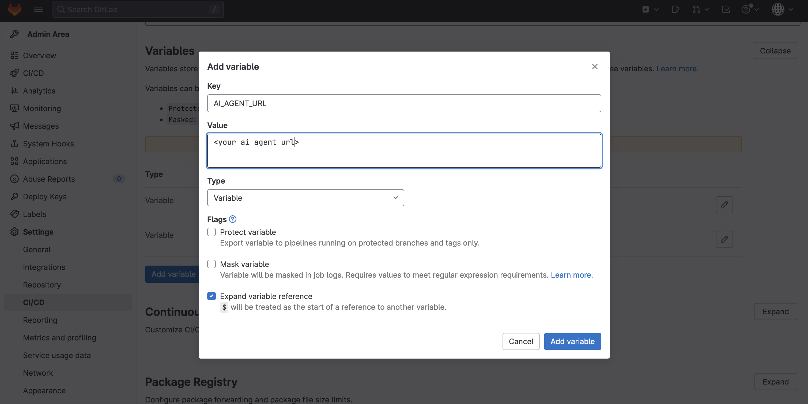

# Configure Gitlab CI

Create an access token for gitlab from the sonarqube page, name is `gitlab`, type is `global`.


Create the `SONAR_HOST_URL` variable in the global CICD configuration item of the gitlab page, pointing to the sonarqube URL


Create the `SONAR_TOKEN` variable. The token had been created for gitlab on sonarqube earlier.


Create the `AI_AGENT_URL` variable. The ai agent url is ai-suggestion we deployed earlier.



The CICD variable configuration is completed.


`User1` and `user2`  had been created via gitlab installation script.


Create a new `dev` group.


Add `user1` and `user2` to the `dev` group.


Clone `https://github.com/rh-demos/my-quarkus` from github to the `dev` group of gitlab.


Import the gitlab project from the sonarqube project page


Enter the `access token` you created earlier for sonarqube.


Browse to find the `My Quarkus` project and click Set up.


Configure analyze to gitlab CI.


Follow the prompts to add the `<sonar.qualitygate.wait>true<sonar.qualitygate.wait>` definition to the `pom.xml` of `My Quarkus` project.


Add and submit the changes from gitlab page.


Navigate to the CICD -> Pipeline configuration of the project from the gitlab page and stop the started pipeline.


Delete the pipeline after stopped


Get the projectKey of My Quarkus in sonarqube from the sonarqube analyze configuration wizard.


Click to complete the wizard configuration and enter the state of waiting for the first code analysis.


Navigate to the gitlab CICD edit page.


Add the following CI definition. The sonarqube `projectKey` and `ai suggestion url` need to be replaced, projectKey can be found from previous copied `.gitlab-ci.yml` content.

```
image: maven:3.6.3-jdk-11

cache:
  paths: []

variables:
  MAVEN_OPTS: "-Dmaven.repo.local=$CI_PROJECT_DIR/.m2/repository"
  PROJECT_KEY: "<your project key>"

stages:
  - build
  - sonar
  - test
  - package

build:
  stage: build
  script:
    - mvn clean compile
  only:
    - master
  tags:
    - your-runner-tag

sonar:
  image: maven:3.6.3-jdk-11
  variables:
    SONAR_USER_HOME: "${CI_PROJECT_DIR}/.sonar"  
    GIT_DEPTH: "0" 
  cache:
    paths: []
  script: | 
    mvn verify sonar:sonar -DskipTests -Dsonar.qualitygate.wait=true -Dsonar.projectKey=${PROJECT_KEY} || true
    SONAR_EXIT_CODE=$?

    if [ -n "${CI_MERGE_REQUEST_IID}" ]; then
      echo "Triggering AI suggestion..."
      curl -s -k -X GET "${AI_AGENT_URL}/suggestion?project_key=${PROJECT_KEY}&merge_request_iid=${CI_MERGE_REQUEST_IID}"
    fi

    exit $SONAR_EXIT_CODE
  allow_failure: false
  only:
  - merge_requests
  - main

test:
  stage: test
  script:
    - mvn test
  only:
    - master
  tags:
    - your-runner-tag

package:
  stage: package
  script:
    - mvn package
  artifacts:
    paths:
      - target/*.jar
  only:
    - master
  tags:
    - your-runner-tag
```

The first pipeline will be triggered after click `Save`, wait for its completion.


Log in to sonarqube as `user1` and fork `My Quarkus` project.


Navigate to the general configuration item of the cloned project (`Visibility, project features, permissions)` and turn off CICD, do not forget to save changes.


