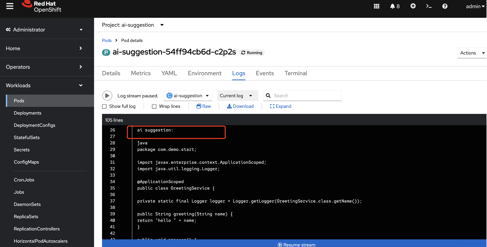

# Verify Code Intelligence

Modify the GreetingService code as User1 and submit it from gitlab page.


The added function with issue is as follows:

```
    public void process() {
        String data = null;
        System.out.println(data.length()); 
    }
```

Create a merge request after the submit is completed, 


Confirm the merge request.


Navigates to the My Quarkus project with `root` user, you will find the Merge Request has been submitted and the pipeline has been triggered.


Wait for the pipeline to complete, you will find the pipeline is failed.


In the comment of the merge request, you will find that the sonarqube analysis report has been added.


Continuing to scroll down, you can see that the code modification suggestions obtained by ai suggestion calling the llama model have been added to the comment of the merge request.


from the ai suggestion log of OpenShift web console page, you will find that ai suggestion invoke the LLM and LLM  suggestions of code changes.



Log in to gitlab as `user1`, comment out the code you just added, and commit


You will find that the pipeline triggered by the merge request of the `My Quarkus` project under `dev` is completed and passed


From the comment of the merge request, you will find that sonarqube analyzes the modification of the merge request and finds that there is a code smell. You can also see that the following comment is the modification suggestion of AI.


if you want to fix the `Code Smell`, you can follow the AI suggstion to change the code.

Log in to gitlab review and you will find that the merge request CI generated earlier has been successful.


Click the title part from gitlab reviewer, you will be navigated to the merge request page of gitlab, approve and merge.


Return to gitlab review and you will find that there are no unfinished merge requests.


After the code had been merged, the CI pipeline was triggered and built successfully.


